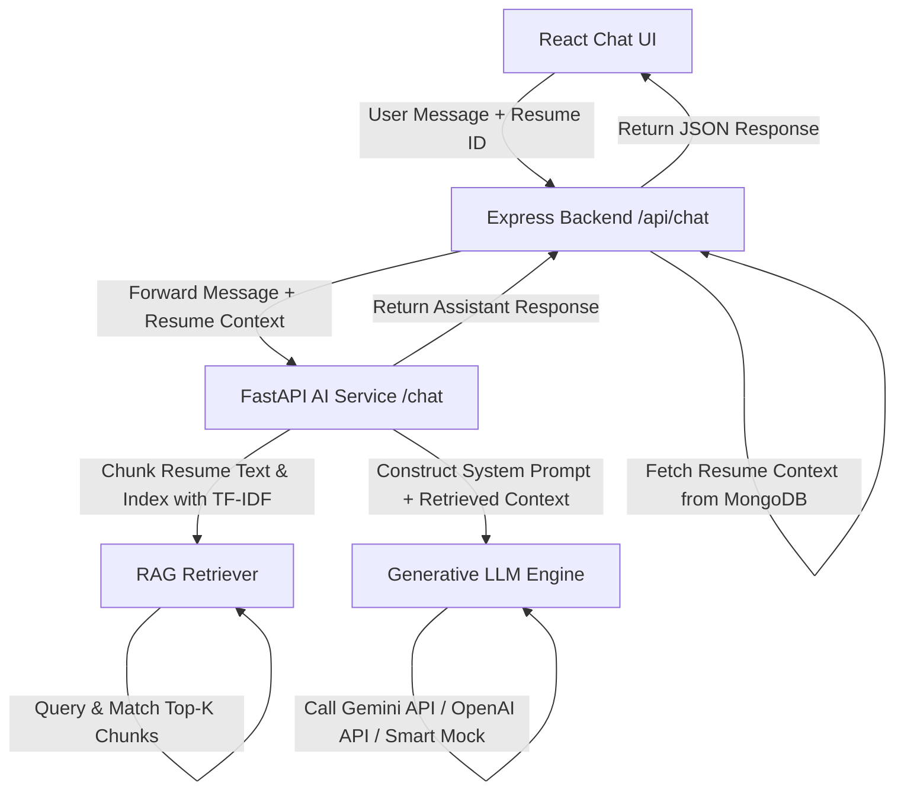

# Implementation Plan: RAG Chatbot Assistant in NextHire

We are going to implement a complete, premium RAG (Retrieval-Augmented Generation) system for the NextHire project. This will allow users to chat interactively with an AI Assistant about their uploaded resumes, target roles, skill gaps, learning roadmaps, and interview preparation.

---

## Architecture Overview



---

## Step-by-Step Tasks

### 1. Python AI-Service (FastAPI) Updates
We will introduce a Retrieval-Augmented Generation engine in the Python AI Service.
- **RAG Engine (`ai-service/rag.py`)**:
  - Implement a chunker that breaks down the raw resume text into paragraph or sentence-level chunks.
  - Implement a TF-IDF retriever using `scikit-learn` to find the most relevant chunks of the resume based on the user's chat message.
  - Implement LLM integration:
    - Support **Google Gemini API** (via standard HTTPS or library) using the `GEMINI_API_KEY` environment variable.
    - Support **OpenAI API** (via standard HTTPS or library) using the `OPENAI_API_KEY` environment variable as a fallback.
    - Implement a **Contextual NLP Generator fallback** that uses the resume, roadmap, projects, and interview questions to construct intelligent, highly realistic responses if no API key is set.
- **FastAPI Routing (`ai-service/main.py`)**:
  - Add a `/chat` POST endpoint that receives the message, history, and resume context (text, skills, target role, missing skills, etc.).

### 2. Node.js Express Backend Updates
We will expose a chat endpoint in the MERN backend.
- **Chat Controller (`backend/controllers/chatController.js`)**:
  - Create a controller `handleChat` that handles user chat requests.
  - Retrieve the requested `resumeId` from MongoDB to pull the extracted text and metadata.
  - Send the user's message, history, and resume context to the Python `ai-service/chat` endpoint.
- **Chat Routes (`backend/routes/chatRoutes.js`)**:
  - Expose `POST /api/chat` protected by the JWT auth middleware.
- **Server Registration (`backend/server.js`)**:
  - Mount `/api/chat` route.

### 3. React Frontend Updates
We will build a high-fidelity, premium chat interface.
- **Chat Page (`frontend/src/pages/Chat.jsx`)**:
  - Design a double-column layout:
    - **Left column**: Resume and target role selector, showing score previews, matching/missing skills, and quick-prompts (e.g. *"Mock Interview"*, *"Cover Letter Draft"*, *"Resume Critique"*).
    - **Right column**: Premium chat pane with message bubbles, avatar indicators, code snippet highlighting, markdown support, scroll-to-bottom behavior, and typing indicators.
  - Integration with the backend API.
- **App Router (`frontend/src/App.jsx`)**:
  - Register the `/chat` route under `PrivateRoute`.
- **Navigation (`frontend/src/components/Navbar.jsx`)**:
  - Add a premium "AI Assistant" link with a spark animation/icon in the Navbar header.
- **Shortcuts**:
  - Add a "Chat with AI" button directly in `Report.jsx` to open the chat with that resume selected automatically.
  - Add a quick action in `Dashboard.jsx`.

---

## API Definition for `/api/chat`

### Request (POST)
```json
{
  "message": "Explain how I can gain experience in Docker and Kubernetes as recommended by my roadmap.",
  "resumeId": "60c72b2f9b1d8e001c888888",
  "history": [
    { "role": "user", "content": "Hi, what is my match for DevOps?" },
    { "role": "assistant", "content": "Your match score is 45%. You need to learn Docker and Kubernetes." }
  ]
}
```

### Response
```json
{
  "success": true,
  "response": "To gain experience in Docker and Kubernetes, I recommend the following plan based on your background...",
  "sources": [
    "Retrieved chunk: Experiencing deployment tools...",
    "Retrieved chunk: Skills target list: docker, kubernetes..."
  ]
}
```
